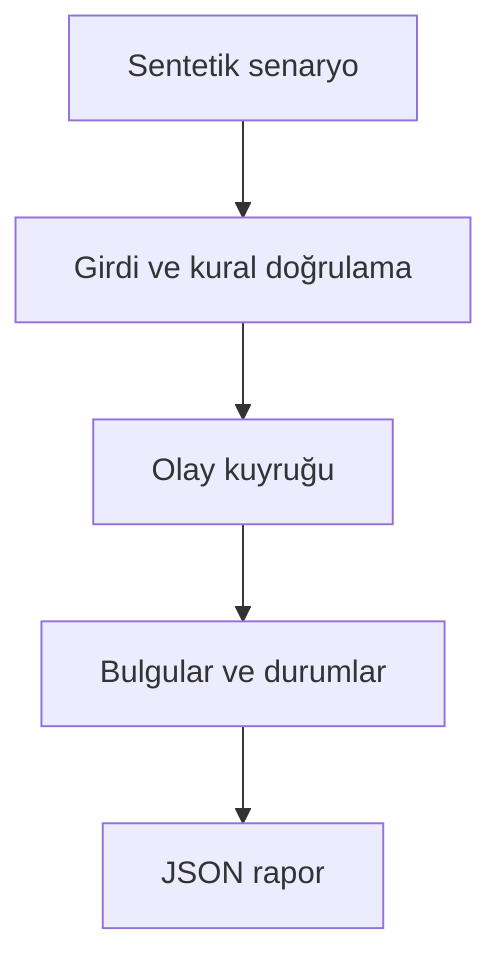

# Mimari

Kesinti sırasında retry politikasının işçi kapasitesi ve toplam gecikme üzerindeki etkisini karşılaştırmak.

Asıl alan akışı: **Ortak varışlar → olay heap → hız sınırı → sağlayıcı kesintisi → retry/deadline**. CLI JSON yükler, çekirdek `run(config)` alan motorunu çağırır ve JSON seri hale getirir. Veritabanı kullanan örnekler geçici dizinde izole edilir; kalıcı sınıflar doğrudan çağrılırken dosya yolu dışarıdan verilir.

## İnvariant ve başarısızlık sınırı

Sanal zaman kullanılır; dört politika aynı varış verisiyle kıyaslanır.

Ağ bağlantısı kurmaz; dağıtık devre kesicinin ve HTTP sunucusunun gerçek davranışını ayrıca ölçmek gerekir.

Her hata kararı makine tarafından okunabilir çıktı veya açık exception üretir. Geçersiz yapılandırma sessizce düzeltilmez. Olası tekrarların güvenliği ilgili çekirdeğin kabul kurallarına bağlıdır; bütün projelere ortak bir retry uygulanmaz.
